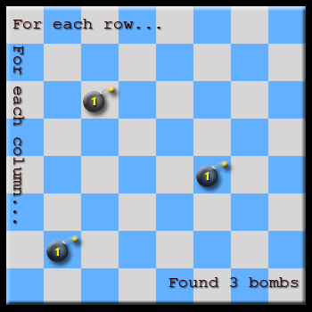
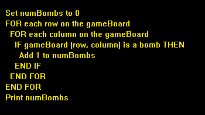
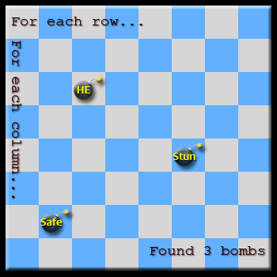
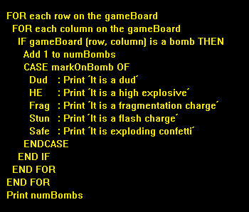
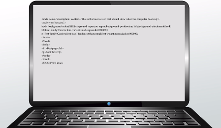

In this lesson, learn what pseudocode is in programming. Learn how to write pseudocode, the common conventions to follow, and the mistakes to avoid.

### Why Should I Write Pseudocode?
A computer program generally tries to solve a well-defined problem using a well-defined algorithm. However, both the problem to be solved and the recipe/algorithm for solving it are initially written in natural language (very similar to day-to-day speaking). We need something much closer to an actual set of computer instructions, but going straight from natural language to computer code can be tedious and complex - especially if you need to do this many times for many different computer languages (and we very often do).

It is often far better to rewrite the algorithm as a set of specific instructions which is very similar to computer code, but not specific to any one computer. That's what we call **pseudocode**...it looks like computer instructions but cannot be executed on a computer.

### How Do I Write Pseudocode?
Writing pseudocode is pretty easy actually:

* Start with the algorithm you are using, and phrase it using words that are easily transcribed into computer instructions.
* Indent when you are enclosing instructions within a loop or a conditional clause. A **loop** is a set of instructions that is repeated. A conditional clause is formed by a comparison and what to do if that comparison succeeds or fails. This technique makes sure it's easy to read.
* Avoid words associated with a certain kind of computer language.

It turns out that there are some fairly standard words you can use. These include standard looping structures like the following:
* FOR … ENDFOR
* WHILE…ENDWHILE

There are also some terms for standard conditional clauses:
* IF … ENDIF
* WHILE … ENDWHILE (this is both a loop and a conditional clause by the way)
* CASE … ENDCASE

There are more, but that's enough for us to present some examples.

### Examples of the Pseudocode
For our first example, we will pretend we have a square game board with one or more bombs hidden among the squares. We want to scan the game board and print the number of hidden bombs. Our algorithm methodically checks each row and each column to see if a hidden bomb is there, and if it is, we add 1 to the total number of bombs. This is one way to write that:

That wasn't hard, was it? Okay, now let's say each bomb has a mark on it, indicating what kind of bomb it is. This makes our game more interesting, since some bombs may startle us but do no real damage. We have written an algorithm that prints out what kind of bomb we've found, and where we found it. We can write that in pseudocode as well.

Do you see how the pseudocode would be pretty easy to rewrite as instructions in virtually any computer language? By taking time out for this simple step of an intermediate 'language' (between natural language and computer instructions), we can now save a lot of time when we need to write our game for many different computers.

### Lesson Summary
Now that we've gone over some key things about **pseudocode** (a set of specific instructions which is very similar to computer code, but not specific to any one computer), we should review. Why should we write in pseudocode? Pseudocode is much more like computer instructions, so that converting from pseudocode to various languages saves some time and trouble.

How do we write pseudocode anyway? It turns out that there are some standard formatting techniques and common words that are used. Insert your labels for various things those standard terms apply to, and away you go. The nice thing about pseudocode is that it makes it very easy to imagine the outcome of the instructions, while making the task of rewriting them as computer instructions easier as well.

### Key Terms

**Pseudocode** - a set of specific instructions which is very similar to computer code, but not specific to any one computer and can't be executed on a computer

**Loop** - a set of instructions that is repeated

### Learning Outcomes
After this lesson, check to make sure you can:
* Explain the usefulness of pseudocode
* Reiterate the key steps in writing pseudocode

## Quiz
1. Which of these is not a standard way to write pseudocode conditional expressions?
   * KEEP GOING UNTIL … THIS CONDITION
2. Which of these is a standard way to write pseudocode loop expressions?
   * FOR … ENDFOR
3. What do computer programs generally try to solve and how?
   * Computer programs generally try to solve a well-defined problem using a well-defined algorithm
4. Why do we write in pseudocode?
   * It makes it easier to convert the algorithm from natural language to computer instructions
5. Why do we indent some pseudocode instructions?
   * We indent to enclose instructions within a loop or a conditional clause