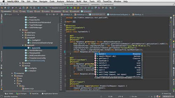
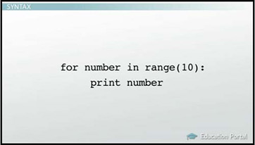
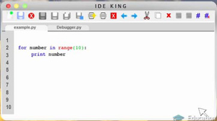
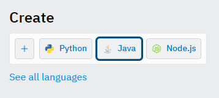
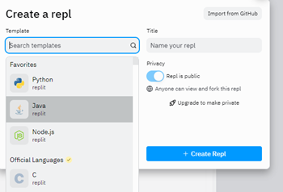
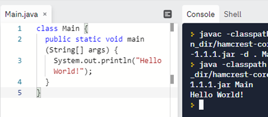

Creating a software program involves writing code, testing code and fixing any parts of the code that are wrong, or debugging. Analyze the process of writing a program and discover how code editor software can make that process easier.

### Steps to Writing a Program
The general steps for writing a program include the following:
* Understand the problem you are trying to solve
* Design a solution
* Draw a flow chart
* Write pseudo-code
* Write code
* Test and debug
* Test with real-world users
* Release program
* Iterate the steps for the next version

This lesson will look more closely at writing code in programming language. Once code has been written, it has to be tested and debugged to make sure it works as intended.

### Writing Code
Computer code is essentially a list of instructions that can be run by a certain program. Code is written in plain text, so that the compiler can read it. Compilers see formatting characters as syntax errors. A unique file extension is given to the document to indicate the nature of the code. For example, a file created using Python is saved with a .py extension, like 'myprogram.py.' However, the actual content of the file is still just plain text.

Because most code is in plain text, you can write code using a basic word processor or text editor. However, it is much more effective to use a software application that is specifically designed for coding in a particular language. For example, when you write a document in plain English, you would use word processor software, which can assist you with things such as formatting, spelling and grammar. Similarly, a code editor provides tools such as syntax checking. Syntax is to code what spelling and grammar are to writing English.

A code editor is also called an **integrated development environment**, or IDE. An IDE is a software application for formatting your code, checking syntax, as well as running and testing your code. Some IDEs can work with multiple programming languages, while some are very specific for only one language.

Here is an example of what a typical IDE looks like:

This may look overwhelming, but you can think of this as a specialized word processor for programmers to write code.

### Syntax
One very useful aspect of IDE is known as syntax highlighting. This means elements of the code are shown in different colors based on what they are. Let's look at a very simple example. Here is the original code in plain text:

   * Original code in plain text

Now let's look at the code in an IDE:

   * Same code in IDE

The colors make it easier to recognize the various elements of the code. For example, in the sample code, the elements 'for,' 'in,' and 'print' are keywords that hold special meaning.

Syntax highlighting makes it easier to read code. However, it does not change the actual meaning of the code, and it is only for human readers.

An IDE includes tools for syntax checking, which is similar to checking grammar and spelling. If code contains syntax errors, the program will simply not execute. An IDE identifies exactly where the syntax errors are.

Most IDEs also have some form of autocompletion system built in. You may be familiar with this if you do any text messaging on a smartphone. As you start typing, the program will determine what it is you are trying to type. For example, if you type 'pr,' the IDE will suggest 'print.' Autocompletion in an IDE will typically provide a list of options to choose from, not just the most likely option. This saves on typing and also reduces typos. Autocompletion in a coding environment is also referred to as intelligent code completion.

### Online Compilers
If you work for an organization, you will most likely use an IDE. However, there are online compilers that provide an easy way to develop and test your code. Whether you are a student or a professional, these tools can be accessed with ease and used to test, desk-check or to collaborate with others on projects. Many times the code can even be exported for importing into an IDE.

Online compilers come in several flavors and for many programming languages. One popular tool is the repl.it suite. For example, the Java 11 compiler is available from Replit.com:

https://replit.com/~.

Under the Create options, click Java.

Click the Create Repl button:

https://repl.it/new/java10. Following is an example of the compiler and its output.

Online compilers also use syntax highlighting and code completion.

### Testing
Once you have written your code and checked for any syntax errors, you are ready to start testing. A program that is free of syntax errors will execute. However, this does not mean it actually works.

For example, let's say you have a file with the payroll information for each employee, with each employee represented by a line. You need a computer program that can read this information line by line and perform some type of payroll-related operation, such as calculating benefits for a certain pay period. The results should then be written down to a new file.

Before running the program on the actual payroll data for a real company, you want to do some testing. Testing consists of determining whether the program executes the tasks intended. Does the program do what it's supposed to do?

You can take a sample of the real data or create your own file that has the same properties as the real data. Typically, you would start testing with a simple version of the payroll information before testing a complete dataset.

In order to test your program, you would run the program using the test file as the input. You then examine the output to make sure it is correct. Did the program create an output file in the desired format? Does the output file contain the correct information? Were the calculations done correctly? Were all the lines in the input file processed?

### Debugging
Now let's say your testing shows the output is not as expected. Now what? Time to start debugging.

A bug in a computer program is a defect - something that prevents the program from executing correctly. **Debugging** is the process of finding and removing bugs from a program.

One approach to debugging is to read through the original code to try to find the bugs. But imagine that your code contains 1,000 lines - and it could be that 999 of those are actually correct. Finding the bug by manually reading through all of the lines is possible but cumbersome.

To make debugging more effective and less time consuming, programmers use a debugger. This is one of those tools in a typical IDE. A debugger helps you walk through your code in a systematic and semi-automatic manner to find the bugs.

Consider the example of the payroll data that needs to be processed. Let's say the bug lies in the fact that the output data cannot be written to the output file due to some issues with the file formatting. All the calculations are done correctly, but when the time comes to write the results to an output file, an error occurs. Debugging would allow you to follow the processing of the data and see that everything went fine up until the writing of the output. So, now you know which lines of code to fix.

Debugging can tell you where the bug is located in the program but not how to fix your code. You still have to go into the code, understand its logic and then correct the code. However, using a debugger can save you a lot of time. Instead of having to look at 1,000 lines of code, you may only have to look at five lines.

### Lesson Summary
An integrated development environment, or IDE, is a software application for formatting your code, checking your syntax and running and testing your code.

Some of the specific tools in an IDE include syntax highlighting and autocompletion.

Once code is free of syntax errors, it needs to be tested to make sure it performs as expected. A debugger can be used to help find the errors in the code.

### Learning Outcomes
After completing this lesson, you should be able to:
* Define integrated development environment (IDE)
* Identify the general steps for writing a program
* Describe the various components of an IDE
* Explain how the tools in an IDE can help you effectively write program code

## Quiz
1. How does using a debugger in an integrated development environment benefit an individual who is writing code?
   * A debugger walks through code in a systemic and automatic manner to find bugs, making the process less time consuming.
2. Which of the following is NOT a typical component of an Integrated Development Environment?
   * Grammar checking
3. How does the IDE component, known as syntax highlighting, aid developers with writing program code?
   * The tool makes it easier to recognize the various elements of code .
4. A code editor that is used to check syntax, format, run, and test code is known as a/an _____.
   * integrated development environment
5. Gwen is an IT programmer for a small, non profit company. She's been assigned to write some new code for her company's payroll department to assist with the roll-out of a new pay for performance system. The new code will affect employees' pay grades, salaries, and bonuses. Gwen has written pseudo-code and the actual code. What should be her next step in the process?
   * Test and debug the code