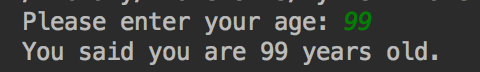

Identify input and output in Python and how to use input in a Python program. Learn about comments in Python and how to add comments in Python, with examples.

### Input, Output, and Comments
All software has three basic components: input, processing, and output. Programs accept input, do something to transform it such as adding two numbers, then provide the results as output. In this lesson we will create a program that accepts user input, processes that input and provides output to the user. We will also look at how to comment our code and the purposes of doing so.

### Providing Output to the Screen
Let's look at how to provide output to the screen. We'll start with output because it is customary to provide users with a prompt indicating what type of information is expected. For example, if we want the user to enter their age, we should provide them with a prompt such as, 'Enter your age:'

We will implement this in Python using the **print()** function. Here is how that is done:

```py
print('Enter your age: ')
```

The result of the code above is that 'Enter your age: ' will be printed to the screen.

As you can see, we put our output inside quotation marks, encased in parentheses. We can use single quotes or double quotes without any impact on the output. We do need to be consistent for each use of the print() function and use pairs of like quotation marks.

### Using the Print Function with Different Python Versions
The code we are using in this lesson is based on Python version 3. It is important to note that we use the print() function differently when using Python 2. The examples below illustrate how the print() function is used in different versions of Python.

Python 2: print 'Single quotes and no parentheses for Python 2'

Python 3: print('Single or double quotes inside parentheses for Python 3')

Now that we know how to prompt the user for input, let's look at how to receive their input.

### Accepting Keyboard Input
Obtaining input from users via their computer's keyboard is a common feature of most programs. We will use the **input()** function, a built-in Python function that halts a program's execution and waits for the user's input. As soon as the Return key is pressed, the **input()** function returns the user's input and the program resumes.

In order to use the input we receive from the user, we need to assign the user's input to a variable. Variables are named memory references such as firstName and lastName.

Let's look at three examples. In our first example, we will use a print() function to provide the user with a prompt. Following that, we will use the input() function. As you can see in the code below, we are using a variable named userAge to store the input the user enters with their keyboard. So, if the user enters 100, the value of userAge will be 100.

```py
print('Please enter your age: ')
userAge = input()
```

The input() function allows us to incorporate a user prompt. In the previous example, we used the print() function for it. We can pass a **parameter** to the input() function by encasing it in quotation marks, inside the parentheses. Parameters are values passed to a method or function for further processing. In our case, we pass 'Please enter your age: ' as a parameter to the input() function. In turn, the input() function will display that parameter to the screen.

As you can see in our second example below, we can combine the two lines of code from our previous example into a single line of code.

```py
userAge = input('Please enter your age: ')
```

For our third example, we will use the data entered by the user. In the code below we have two lines of code. The first line outputs a prompt to the user using the input() function. The program will stop until the Return key is pressed, at which time, the user's input will be stored in the variable userAge. The second line outputs text to the screen incorporating the user's input. You will notice that we are passing three parameters to the print() function, each separated by a comma.

```py
userAge = input('Please enter your age: ')
print('You said you are', userAge, 'years old.')
```
Program Output:


### Adding in-Code Comments

It is helpful to include notes in our Python programs to help us remember what is happening. This makes the code easier to debug and update. These notes, formally referred to as comments or in-code comments, are ignored by Python and do not impact the program's efficiency.

We use the hash symbol to annotate our comments. Everything to the right of the hash symbol until the end of the line is ignored. In the example below, you will notice two different uses of comments: full line and partial line.

```py
# Get age from user and output results to screen
userAge = input('Please enter your age: ') # put the return value in userAge
print('You said you are', userAge, 'years old.')
```

Including comments in your programs is considered good programming practice and a habit that you should start forming early.

### Summary
The **input()** and **print()** are both built-in Python functions. We use the input() function to obtain input from the user and learned that an optional **parameter** can be included to provide the user with a prompt. Parameters are values passed to a function inside the parentheses. Program execution is paused until the user presses their keyboard's Return key. We store the input() function's return value into a **variable**, which is a named reference to a memory location. We use the print() function to provide output to the screen. Using good programming practice, we can include **comments**, also referred to as **in-code comments**, in our programs, preceding them with the hash symbol. These comments are notes that are intended for programmers to read and are ignored by Python.