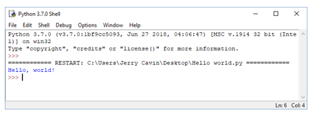
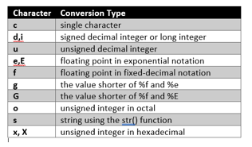
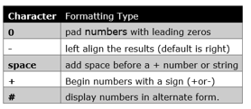
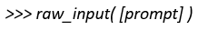
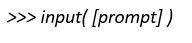

This lesson will teach a practical application of Python's print and input methods. We will demonstrate the print() statement by outputting fixed data to the screen, and then demonstrate how input() can output data that isn't quite so predictable.

### Lesson Overview & Knowledge Required
Welcome! In this lesson, we will look at a practical application of two fundamental concepts: **output** and **input**. In Python, we usually associate output with **print()** and input with **input()**. We're going to learn how to do two things:

1. Output a fixed statement to the screen ('This is a simple Python program')
2. Get random input from the user console (which we can then print to the screen)

These two techniques will help us go from an unchanging program (that always prints the same thing) to something more useful (a program capable of printing a variety of things).

To learn Python I highly recommend that you download the Python interpreter and enter each example to see how it works. The Python interpreter can be downloaded from the website ( www.python.org ). Python 3.7.0 is currently available on the site. All examples in this lesson have been generated using version 3.7.0

An example of how to use the interpreter follows.
* Go to the File drop-down and create your file (in this case HelloWorld.py)
* Enter the text print('Hello, world!') in the interpreter window
* Save the file. You can now select Run to execute the file.


   * Figure 1: Python Interpreter

### Repl.it - Online Python Editor

If you are not able to install software, or would just like a free online tool to use for testing Python code, there is an online editor available at the following URL: https://repl.it/languages/python3. You can quickly test your code without having to install a full software package.

## Program Code

### Objective 1: Using Print in Python
The first part of our lesson is about print(). How do we tell it what we want the output to look like?

The print() function in Python formats the data and sends it to the output in many formats. To explain, should Python treat our outgoing, formatted data as literal text (ASCII codes) or as actual numbers? What kind of numbers (integer, real, etc.)?

The following sections provide a few basic examples.

The print() function is used to output data to the standard output device (usually the screen). For example:

```py
print('This is a simple Python program.')
```

Which results in the following:

```bash
This is a simple Python program.
```

Figure 2 shows some of the data conversions that can be done in Python. These can be combined with print statements as shown in the examples that follow.


   * Figure 2: Python Conversion Types

```py
print('%10.3e'% (3.14159))
```

The result is:

`3.142e+00`

```py
print('%10.3E'% (3.14159))
```

Result: `3.142E+00`

```py
print('%10o'% (314))
```

Result: `472`

```py
print('%10.3o'% (31))
```

Result: `037`

```py
print('%10.6o'% (31))
```

Result: `000037`

```py
print('%5x'% (3141))
```

Result: `c45`

```py
print('%5.5x'% (314))
```

Result: `0013a`

```py
print('%5.4X'% (31))
```

Result: `001F`

### Formatting Output with 'Flags'

Another option to format strings are with flags:


   * Figure 3: Python Flags

Let's look at examples of print with flags:

```py
print('%#5X'% (3))
```

Result: `0X3`

```py
print('%5X'% (31))
```

Result: `1F`

```py
print('%#5.4X'% (31))
```

Result: `0X001F`

```py
print('%#5o'% (31))
```

Result: `0o37`

```py
print('%+d'% (31))
```

Result: `+31`

```py
print('%+2d'% (31))
```

Result: `+31`

```py
print('% 2d'% (31))
```

Result: `31`

```py
print('%2d'% (31))
```

Result: `31`

### Formatting Output with the 'width' option

The width option is a positive integer specifying the minimum field width. If the converted value is shorter than width, spaces are added on left or right (depending on flags):

```py
print('(%30s)' % 'right justify')
```

Result: `( right justify)`

```py
print('(%-30s)' % 'left justify')
```

Result: `(left justify )`

### Formatting Output with the 'precision' Option

The symbol for precision is a dot (.) followed by a positive integer. Note the use of the %f conversion specifier here:

```py
print('%.2f' % 3.14159)
```

Result: `3.14`

### Printing with Dynamic Formatting

Sometimes in programming, you may want to format a string but you do not know what size it will be. In this case, you can print it as a standard length using dynamic formatting using the * character:

```py
print ('%*s : %*s' % (20, 'John', 20, 'Smith'))
```

Result: `John : Smith`

## Objective 2: Using Input in Python

The ability to output stuff to the screen is cool, but it would get old very quickly if it never changed (we would always know what was going to happen). A Python programming can do more than just obey a set of instructions; it can ask the world questions and respond to the replies in a variety of ways. That not only makes this more interesting, it makes our programs more useful and surprising. How does Python ask questions? One way is using the input() method.

There are very few programs that operate without data somehow being entered into the system. Some of the ways data are entered are through: another computer, a port, a network, a mouse, or a database - but most often data are entered by a person on a keyboard. To do this Python provides the input() function.

When the input function is called, the program flow halts until the user has entered the keystrokes and hit the return key. The keys entered by the user are now retained for processing by the application. So let's look at some of the ways the input() function can process the data.

The raw_input() function asks the user to enter a string of data (ending with a newline), and returns a simple string. It takes a prompt argument, which is displayed to the user before they enter data.


   * Figure 4: Raw Input

Python's input() method reads a line from input (usually from the user), and attempts to evaluate the line. The syntax for the input() function is


   * Figure 5: Input Function

For example:

```py
inputString = input('What is your name? ')
```

Result: `What is your name? Python`

```py
print('Hello', inputString)
```

Result: `Hello Python`

In the example above the input function returns a string and assigns it to the inputString variable. Sometimes we are interested in entering numbers into the program. To do this the user entry will be returned as a string. It is then converted to the proper type, like this:

```py
myInteger = int(input('Enter a number: '))
```

Result: `Enter a number: 100`

```py
print(type(myInteger))
```

Result: `<class 'int'>`

```py
myFloat = float(input('Enter the value for Pi: '))
```

Result: Enter the value for Pi: `3.14159`

```py
print(type(myFloat))
```

Result: `<class 'float'>`

```py
myList = list(input('Enter a list of numbers: '))
```

Result: `Enter a list of numbers: 1 2 3 4 5 6 7 8 9 10`

```py
print(type(myList))
```

Result: `<class 'list'>`

## Code Application
Now you be the teacher; use what you have just learned to write a number guessing game. How can you go about it? Let's say the secret number is 42. How would you use Python to ask the user to guess the secret number? How would you let them know they were right or wrong? Have fun and see if you can do it now.

### Follow-Up Question
1. Can you create Python code to tell the user if they are too high, too low or just right?

```py
guess = int(input("Guess the secret number!"))

if guess == 42:
    print("Your guess is just right")
elif guess < 42:
    print("Too low!")
else:
    print("Too high!")
```

## Answer Key

### Code Application
Following is code for the guessing game. It requests input, then tests that number to see if it is 42 or wrong.

```py
myNumber = int(input('Enter a number:'))
if(myNumber == 42) :
print('yes you guessed right')
else :
print('sorry try again')
```

### Follow-Up Question

```py
myNumber = int(input('Enter a number:'))
if(myNumber == 42) :
print('yes you guessed right')
else :
if(myNumber < 42) :
print('number too low')
else:
if(myNumber > 42) :
print('too high')
```