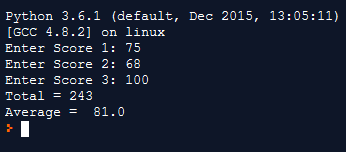

In this practical lesson, you will write Python code. You will review the Python data types as well as arithmetic operators. Next, you will develop an application that accepts input, performs arithmetic, and displays the output.

### Lesson Overview & Knowledge Required
In this lesson, you will develop a Python application that takes three inputs from the user and calculates totals and averages. In order to successfully complete, this lesson, you should be able to explain data types in Python, perform arithmetic in Python, and write code that accepts input and displays output.

###  Compiling and Running Code
In order to run your program, you will need an Integrated Development Environment (IDE) such as the community version of PyCharm. You can download PyCharm at https://www.jetbrains.com/pycharm/download.

Another option is an online compiler, such as the one here: https://repl.it/languages/python3. This is a very beneficial tool that lets you run real Python code on the fly and is great for testing your code.

### Program Code
In the following code we will be working with both integer and float data types. However, Python is smart enough to know which data type to use. However, when we take input from the user, Python assumes that it is a string. We therefore have to tell it that we are working with an int.

Python uses the same arithmetic operators you are comfortable with on a calculator (plus = +; minus = -; divide = /; multiply = *).

The code below asks for two values from the user and then adds them up.

```py
# Program to provide total
# of two user-generated scores
# Get three scores from the user
score1 = input('Enter score 1: ')
score2 = input('Enter score 2: ')
# Calculate and print total score
# Convert input strings to int before adding
total = (int(score1) + int(score2))
print('The total of the two scores is: ', total)
```

### Code Application
Now it is your turn to write code. Modify the previous program and add a third score, also an integer. Complete the following steps:
* Add all three numbers
* Determine the average of the three scores

```py
# Program to provide total
# of two user-generated scores
# Get three scores from the user
score1 = input('Enter score 1: ')
score2 = input('Enter score 2: ')
score3 = input('Enter score 3: ')
# Calculate and print total score
# Convert input strings to int before adding
total = (int(score1) + int(score2) + int(score3))
print('The total of the three scores is: ', total)

average = total / 3
print('The average of the 3 scores is:', average)
```

### Follow-Up Questions
Now that you have a working Python, answer the following questions:

* What happens if you leave out the **int** keyword, and enter values such as 53.2345? Why?
* Write the code to display the average, but only use one line of code
* In the previous step, what happens if you misplace parentheses, or do not use them?

### Answer Key
Following are the answers to the code application and the follow-up questions.

#### Code Application
The code application will add another score variable, score3. Be sure to specify int for this as well. Once you have the total, you can find the average by dividing that total by 3:

```py
score1 = input('Enter Score 1: ')
score2 = input('Enter Score 2: ')
score3 = input('Enter Score 3: ')
total = int(score1) + int(score2) + int(score3)
average = total / 3
print("Total =", total)
print("Average = ", average)
```

The output, as run from the online compiler, should resemble Figure 1:


   * Figure 1: Code Application Output


### Follow-Up Questions
Following are the answers to the follow-up questions:

#### Omitting Int
If you omit the **int** in the calculation of the total, Python will display an error, such as the following:

```
Traceback (most recent call last):

Filte "main.py", line 4, in <module>

total = score1 + score2 + score3

TypeError: must be str, not int
```

This means that Python expected a string by default. User input is defaulted to string, and so you must tell it that you are using an integer value.

#### One Line of Code
You can achieve the same result by using only one line of code.

```py
average = (int(score1) + int(score2) + int(score3)) / 3
```

#### Order of Operations
If you had not included the parentheses, or forgotten one or two, the output would be different. For example, this code:

```py
average = int(score1) + int(score2) + int(score3) / 3
```

would result in an average of 156.66. Why?

This is because Python follows the same order of operations as in regular math. We call it **PEMDAS**, meaning parenthesis, exponents, multiplication, division, addition, subtraction. Operations are carried out in that order. Therefore, we really need to encase the addition operation (score1 + score2 + score3) in its own set of parentheses before dividing.